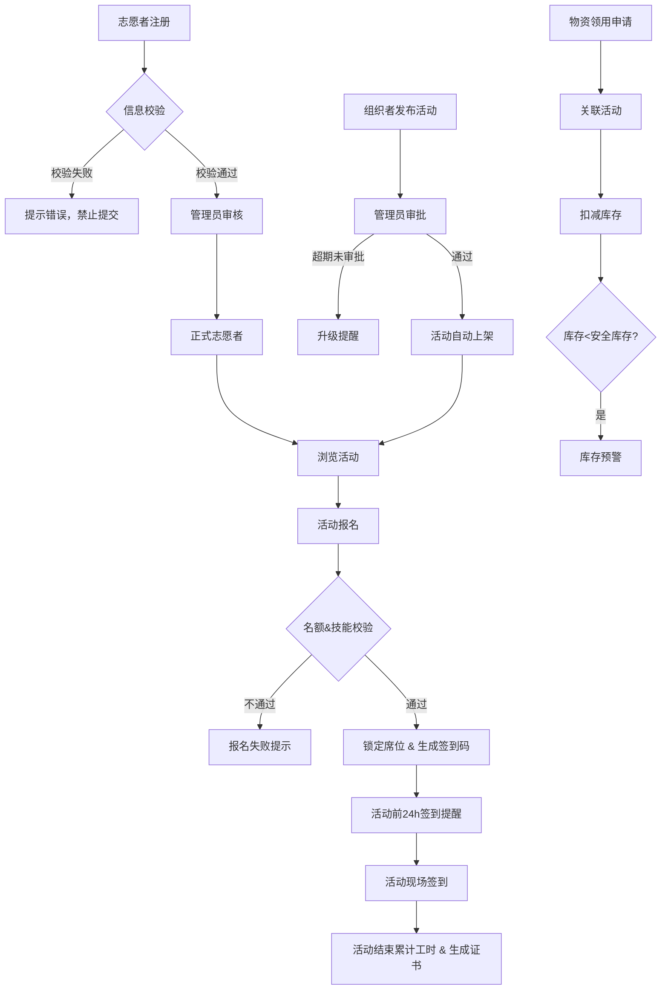

## 1. 产品概述

志愿者管理系统是一套面向志愿服务组织的全流程信息化管理平台，涵盖志愿者招募注册、活动发布审批、报名签到管理、物资库存管控及数据统计分析等核心功能，旨在提升志愿服务组织的运营效率和管理水平。

- 解决问题：传统人工管理方式效率低下、信息易出错、数据难以追溯
- 目标用户：志愿者、活动组织者、系统管理员
- 产品价值：实现志愿服务全流程数字化、自动化、可追溯

## 2. 核心功能

### 2.1 用户角色

| 角色 | 注册方式 | 核心权限 |
|------|----------|----------|
| 志愿者 | 自助注册 | 浏览活动、报名参与、查看工时、领取物资 |
| 活动组织者 | 管理员创建 | 发布活动、查看报名、物资申请、数据查看 |
| 系统管理员 | 内置账号 | 用户管理、活动审批、库存管理、报表导出、系统配置 |

### 2.2 功能模块

1. **登录与首页**：角色登录、数据概览、快捷入口、通知中心
2. **志愿者管理**：注册信息录入、身份证校验、年龄校验、紧急联系人校验、资料审核
3. **活动管理**：活动发布、审批流程、升级提醒、活动上架、活动详情
4. **报名签到**：活动报名、名额校验、技能匹配、席位锁定、电子签到码、自动提醒
5. **工时与证书**：工时自动累计、服务证书生成
6. **物资管理**：物资库存、领用申请、关联活动、库存预警
7. **统计报表**：服务频次统计、工时统计、参与率统计、PDF月度报告导出

### 2.3 页面详情

| 页面名称 | 模块名称 | 功能描述 |
|----------|----------|----------|
| 登录页 | 登录表单 | 账号密码登录、角色选择、验证码 |
| 系统首页 | 数据概览 | 活动数量、志愿者人数、总工时、物资库存等核心指标卡片 |
| 系统首页 | 快捷入口 | 常用功能快速导航 |
| 系统首页 | 通知中心 | 审批提醒、活动提醒、库存预警等消息列表 |
| 志愿者注册页 | 信息表单 | 基本信息、身份证号、联系方式、紧急联系人、技能标签 |
| 志愿者注册页 | 实时校验 | 身份证格式校验、年龄≥18校验、紧急联系人完整性校验 |
| 志愿者列表页 | 数据表格 | 志愿者信息展示、搜索筛选、状态管理 |
| 活动发布页 | 活动表单 | 活动类型、地点、时间、人数上限、技能要求、物资需求 |
| 活动审批页 | 审批列表 | 待审批活动、审批操作、审批意见、超期升级提醒 |
| 活动列表页 | 活动展示 | 已上架活动展示、搜索筛选、报名入口 |
| 活动详情页 | 详细信息 | 活动信息、报名状态、签到码、物资清单 |
| 报名管理页 | 报名列表 | 报名人员、名额余量、技能匹配状态 |
| 物资列表页 | 库存管理 | 物资名称、当前库存、安全库存、预警状态 |
| 物资领用页 | 领用申请 | 关联活动、领用数量、自动扣减库存 |
| 统计报表页 | 数据统计 | 按活动类型/志愿者维度统计服务频次、总工时、参与率 |
| 统计报表页 | 报告导出 | 生成并导出PDF格式月度运营报告 |

## 3. 核心流程

### 3.1 志愿者注册流程
志愿者填写注册信息 → 系统实时校验（身份证格式、年龄≥18、紧急联系人完整）→ 校验通过提交资料 → 管理员审核 → 审核通过成为正式志愿者

### 3.2 活动发布审批流程
组织者填写活动详情 → 提交审批 → 管理员待办提醒 → 管理员在线审批 → 审批通过自动上架 → 超期48小时未审批触发升级提醒给上级管理员

### 3.3 活动报名签到流程
志愿者浏览活动 → 选择感兴趣且空闲时段的活动 → 系统校验名额余量和技能匹配 → 校验通过锁定席位 → 生成电子签到码 → 活动开始前24小时自动发送签到提醒 → 现场签到 → 活动结束自动累计工时并生成服务证书

### 3.4 物资领用流程
组织者创建物资领用申请 → 关联具体活动 → 填写领用物资及数量 → 系统自动扣减库存 → 库存低于安全库存阈值时触发预警

### 3.5 主流程图

## 4. 用户界面设计

### 4.1 设计风格
- **主色调**：#4F46E5（靛蓝）- 代表信任与奉献
- **辅助色**：#10B981（翠绿）- 代表希望与活力，#F59E0B（琥珀）- 代表提醒与警示
- **中性色**：#1F2937（深灰文字）、#6B7280（辅助文字）、#F9FAFB（背景）
- **按钮风格**：圆角8px，主按钮实色填充，次要按钮描边样式，带悬停微动效
- **字体**：标题使用 Noto Sans SC Bold，正文使用 Noto Sans SC Regular
- **布局风格**：左侧导航栏 + 顶部工具栏 + 主内容区卡片式布局
- **图标风格**：使用 Heroicons 线性图标，简洁现代

### 4.2 页面设计概述

| 页面名称 | 模块名称 | UI元素 |
|----------|----------|--------|
| 登录页 | 登录表单 | 居中卡片布局，渐变背景，品牌Logo，表单动效，错误提示动效 |
| 系统首页 | 数据概览 | 4个统计卡片带数字滚动动画，图表区域展示活动趋势和工时分布 |
| 系统首页 | 通知中心 | 右侧消息列表面板，未读消息高亮红点提示 |
| 志愿者注册页 | 信息表单 | 分步骤表单（基本信息/身份信息/联系信息），实时校验红色边框提示 |
| 活动列表页 | 活动卡片 | 网格布局卡片，悬停上浮效果，活动状态标签，报名进度条 |
| 活动审批页 | 审批列表 | 表格布局，超期项琥珀色高亮，审批操作快捷按钮 |
| 物资管理页 | 库存卡片 | 卡片列表，低库存项红色边框+预警图标，库存进度条 |
| 统计报表页 | 数据图表 | 柱状图+饼图组合，数据筛选器，导出按钮悬浮固定 |

### 4.3 响应式设计
- 采用桌面优先设计，主断点为 1024px
- 平板端：左侧导航折叠为图标模式，内容区自适应
- 移动端：底部Tab导航，单列卡片布局，表格转卡片展示
- 所有交互元素最小触控尺寸 44x44px
