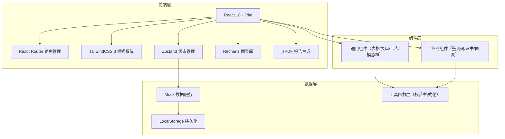
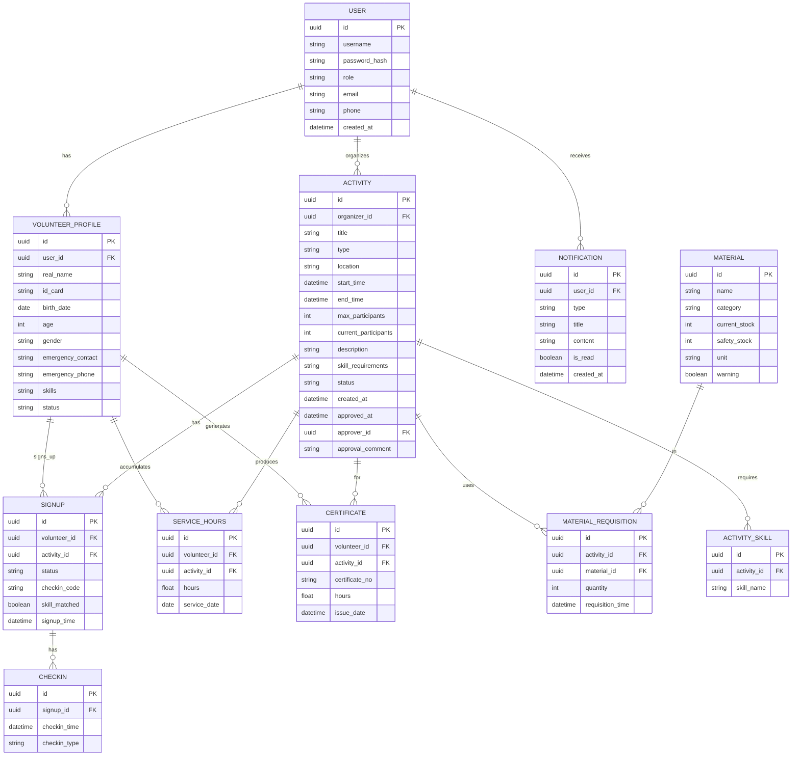

## 1. 架构设计



## 2. 技术选型说明

- **前端框架**：React 18 + TypeScript，使用函数式组件和 Hooks
- **构建工具**：Vite 5，提供快速的开发体验和构建性能
- **样式方案**：TailwindCSS 3，原子化 CSS，配合自定义主题色
- **路由管理**：React Router v6，支持嵌套路由和路由守卫
- **状态管理**：Zustand，轻量级状态管理，替代 Redux 降低复杂度
- **图表库**：Recharts，基于 React 的图表组件库，支持柱状图、饼图、折线图
- **PDF生成**：jsPDF + html2canvas，实现报告和证书的 PDF 导出
- **数据持久化**：LocalStorage + Mock 数据，实现前端独立运行
- **UI 图标**：@heroicons/react，符合设计风格的线性图标

## 3. 路由定义

| 路由 | 页面名称 | 访问权限 | 说明 |
|------|----------|----------|------|
| `/login` | 登录页 | 公开 | 用户登录入口，角色选择 |
| `/register` | 志愿者注册 | 公开 | 新志愿者自助注册 |
| `/dashboard` | 系统首页 | 所有登录用户 | 数据概览、快捷入口、通知中心 |
| `/volunteers` | 志愿者列表 | 管理员/组织者 | 志愿者信息管理 |
| `/volunteers/:id` | 志愿者详情 | 管理员/组织者 | 查看志愿者详细信息和服务记录 |
| `/activities` | 活动列表 | 所有登录用户 | 已上架活动展示和报名 |
| `/activities/create` | 发布活动 | 组织者/管理员 | 新建活动提交审批 |
| `/activities/approval` | 活动审批 | 管理员 | 待审批活动列表和审批操作 |
| `/activities/:id` | 活动详情 | 所有登录用户 | 活动信息、报名、签到码 |
| `/activities/:id/signup` | 报名管理 | 组织者/管理员 | 报名人员管理 |
| `/materials` | 物资库存 | 管理员/组织者 | 物资列表和库存状态 |
| `/materials/requisition` | 物资领用 | 组织者/管理员 | 创建领用申请 |
| `/statistics` | 统计报表 | 管理员 | 数据统计和报告导出 |
| `/certificate/:id` | 服务证书 | 志愿者 | 查看和下载电子证书 |

## 4. 数据模型

### 4.1 ER图



### 4.2 核心工具函数

```typescript
// 身份证号码校验
function validateIdCard(idCard: string): { valid: boolean; message?: string; birthDate?: Date; age?: number }

// 年龄校验（年满18周岁）
function validateAge(birthDate: Date): { valid: boolean; message?: string; age: number }

// 紧急联系人完整性校验
function validateEmergencyContact(name: string, phone: string): { valid: boolean; message?: string }

// 技能匹配校验
function checkSkillMatch(volunteerSkills: string[], requiredSkills: string[]): { matched: boolean; matched: string[]; missing: string[] }

// 名额余量校验
function checkCapacity(current: number, max: number): { available: boolean; remaining: number }

// 安全库存检查
function checkSafetyStock(current: number, safety: number): { isWarning: boolean; diff: number }

// 生成电子签到码
function generateCheckinCode(): string

// 生成证书编号
function generateCertificateNo(): string
```

## 5. 项目目录结构

```
volunteer-system/
├── public/
│   └── favicon.ico
├── src/
│   ├── assets/              # 静态资源
│   │   └── styles/          # 全局样式
│   ├── components/          # 通用组件
│   │   ├── ui/              # 基础UI组件
│   │   │   ├── Button.tsx
│   │   │   ├── Card.tsx
│   │   │   ├── Input.tsx
│   │   │   ├── Modal.tsx
│   │   │   ├── Table.tsx
│   │   │   └── Badge.tsx
│   │   └── business/        # 业务组件
│   │       ├── CheckinCode.tsx
│   │       ├── Certificate.tsx
│   │       ├── StatCard.tsx
│   │       └── NotificationPanel.tsx
│   ├── pages/               # 页面组件
│   │   ├── Login.tsx
│   │   ├── Register.tsx
│   │   ├── Dashboard.tsx
│   │   ├── volunteers/
│   │   ├── activities/
│   │   ├── materials/
│   │   └── Statistics.tsx
│   ├── store/               # Zustand状态管理
│   │   ├── useAuthStore.ts
│   │   ├── useVolunteerStore.ts
│   │   ├── useActivityStore.ts
│   │   ├── useMaterialStore.ts
│   │   └── useNotificationStore.ts
│   ├── utils/               # 工具函数
│   │   ├── validators.ts    # 校验函数
│   │   ├── generators.ts    # 生成器函数
│   │   ├── formatters.ts    # 格式化函数
│   │   └── pdfExport.ts     # PDF导出
│   ├── mock/                # Mock数据
│   │   ├── data.ts
│   │   └── seed.ts
│   ├── types/               # TypeScript类型定义
│   │   └── index.ts
│   ├── hooks/               # 自定义Hooks
│   │   └── useCurrentUser.ts
│   ├── router/              # 路由配置
│   │   └── index.tsx
│   ├── App.tsx
│   └── main.tsx
├── index.html
├── package.json
├── vite.config.ts
├── tailwind.config.js
├── postcss.config.js
└── tsconfig.json
```
